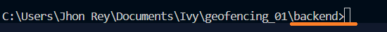
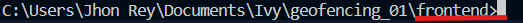

# POE_System

## Table of Contents

- [Backend Installation](#backendinstallation)
- [Usage](#usage)

## Backend Installation

To install this project, follow these steps:

1. clone the main branch:

    "git clone -b dev_2 https://github.com/keeper0497/POE_System.git"

2. Go to backend directory:

    2.1 natigate to "backend" folder then type the syntax below in the address bar

        cmd .

    2.2 After opening the CMD. Open the VScode by the command below:

        code .

3. install virtual environment:

    note: if you already install this feel free to skip

    3.1 to install virtualenv use this command
    
        "pip install virtualenv"

4. Create a virtual environment:
    
    4.1 to create virtualenv use this command

        "python -m venv .env"

    note: the ".env" is the name of the virtualenv

5. install the requirements.txt

    5.1 install the requirements.txt by the command below

        pip install -r requirements.txt

    note: wait for the installation to finish. it will vary to the internet connection

6. Make the migrations

    6.1 to patch the migration use this command

        python manage.py makemigrations

    6.2 to install the migration use this command

        python manage.py migarte

7. Last is to create the superuser

    note: the super user is the user that can access the django admin panel

    7.1 to create a superuser use the command below

        python manage.py createsuperuser

    7.2 just fill out all the required fields

8. Then last is to run the server to access its content

    8.1 use this command

        python manage.py runserver

## Frontend Installation

1. Open the Terminal in VScode
    note: Always use "command prompt"

2. After opening the VScode terminal you need to go to "frontend" folder:
    note: to check if kung anung folder kana hilingun mo iyong last word sa terminal mo gaya nito

    

    dapat nasa frontend siya like this

    

    call ka na lang halawig eh
    

## Usage

1. To access the login page use this url path. just paste the url to the browser
    "http://127.0.0.1:8000/login/"

2. To access the register page use this url path
    "http://127.0.0.1:8000/register/"

## UPDATES

1. Create a frontend code for user module using React js

2. Finish 80 percent the backend codes the 20 percent is for finalization and debuging of there are need to change

3. Connect the Backend and Frontend codes
